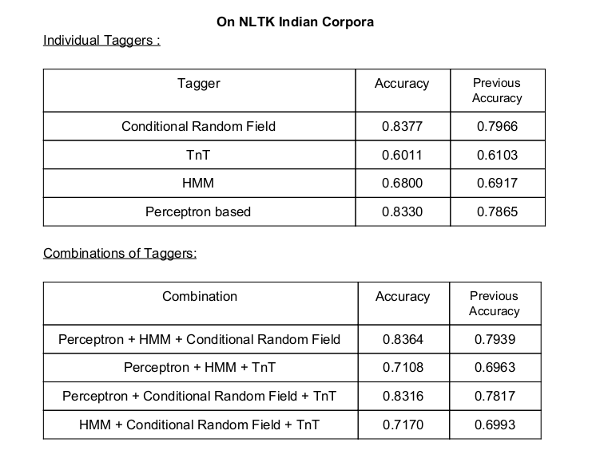

# NLTK-POS-Tagger
We explain the procedure to improve accuracy of nltk pos taggers on Telugu language by utilizing existing annotated knowledge in Telugu language. Here we discuss the models we chose to train and improve their accuracy by appending essential features.
There are several POS taggers based on several approaches
such as lexical based, rule based, probabilistic methods ,e.t.c. NLTK package
provides us with a collection of such taggers.

## Improving Accuracy of NLTK Tagger for Telugu
### Feature Adding:
We have observed that the suffix of the word is playing an
important role in classifying the word. Suffix of lengths up to 7 is added (more than
that seems to reduce performance). And along with that few helpful features that are
added are mentioned below:
* 1 . Suffix[-1:] - suffix of length 1.
* 2 . Suffix[-2:] - suffix of length 2.
* 3 . Suffix[-3:] - suffix of length 3.
* 4 . Suffix[-4:] - suffix of length 4.
* 5 . Suffix[-5:] - suffix of length 5.
* 6 . Suffix[-6:] - suffix of length 6.
* 7 . Suffix[-7:] - suffix of length 7.
* 8 . Prefix[:1] - prefix of length 1.
* 9 . Prefix[:2] - prefix of length 2.
* 10 . Prefix[:3] - prefix of length 3.
* 11 . Prefix[:4] - prefix of length 4.
* 12. [‘Is_num’] - if a token is a number.
* 13. [‘RP_1’] - if length of the token <= 4.
* 14. [‘ RP_0’] - if length of the token > 4.
* 15. [word+1] - next token.
* 16. [word+2] - next to the next token.
* 17. [word-1] - previous token.
* 19. [‘PUNCT’] - if token is a punctuation mark.
* 20. [‘word’] - actual token

### Ensemble methods:
We have used combinations of pos taggers and used a simple
majority voting method to choose the result. Combinations of 3 taggers using 4 nltk
taggers is shown below.
* 1. 'perceptron', 'hmm', 'crf'
* 2. 'perceptron', 'hmm', 'tnt'
* 3. 'perceptron', 'crf', 'tnt'
* 4. 'hmm', 'crf', 'tnt'

## Results

